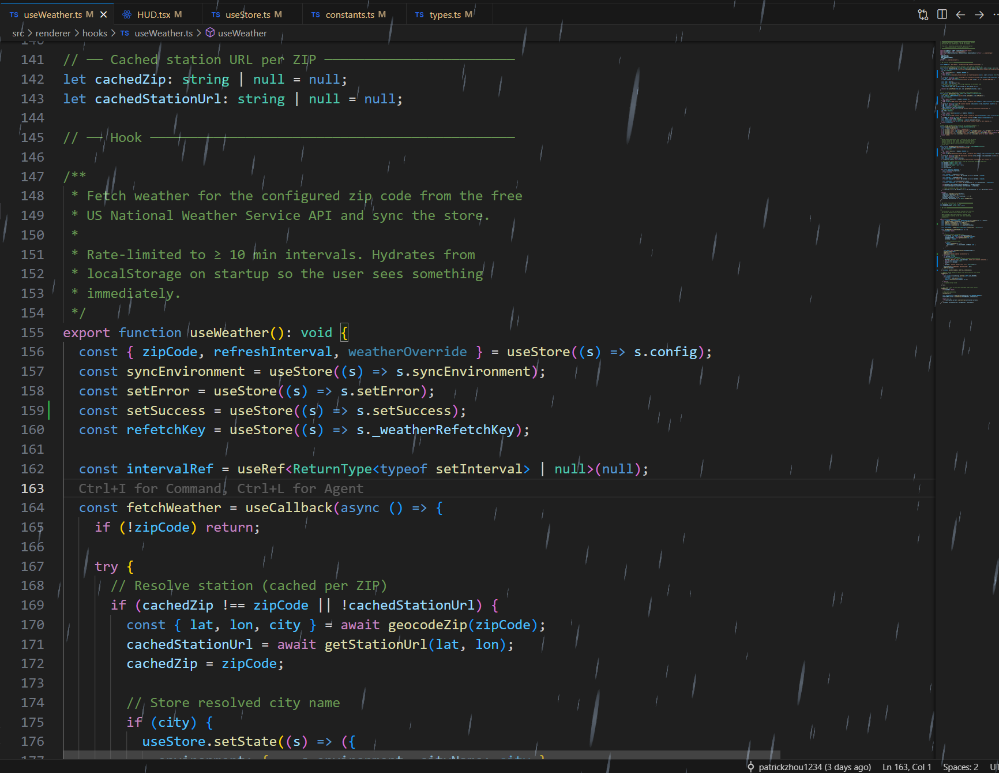
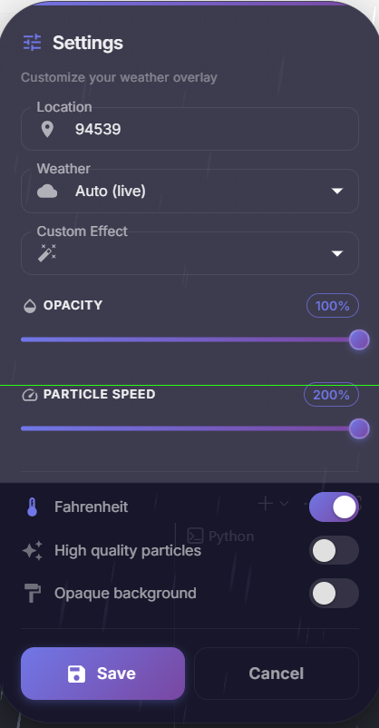

# CozyOverlay

> A procedural weather overlay powered by Electron, React, Three.js, and OpenWeatherMap.
> **Vibecoded**

## Overview

CozyOverlay brings the atmosphere of the outdoors directly to your desktop. Using procedural generation and 3D rendering, it creates immersive weather effects that overlay your screen, making your digital workspace feel a little more... cozy.



## Features

* **Procedural Weather:** Dynamic 3D weather effects using **Three.js** and **React Three Fiber**.
* **Desktop Integration:** Seamless overlay experience powered by **Electron**.
* **Performance Metrics:** System monitoring integration via **systeminformation**.
* **Modern Stack:** Built with **React**, **TypeScript**, and **Zustand** for state management.



## Getting Started

### Prerequisites

* Node.js (v18+ recommended)
* npm (or yarn/pnpm)

### Installation

1. Clone the repository:

   ```bash
   git clone https://github.com/patrickzhou1234/WeatherOverlay.git
   cd WeatherOverlay
   ```
2. Install dependencies:

   ```bash
   npm install
   ```

### Running Locally

To start the development server with hot-reloading (Vibecode mode on 🚀):

```bash
npm run dev
```

This will concurrently launch the Electron main process and the React renderer.

### Building for Production

To build the application for your OS:

```bash
npm run build
```

To package it for distribution (installer/executable):

```bash
npm run dist
```

To run the production build locally:

```bash
npm start
```

## Technologies

* **Core:** Electron, React, TypeScript
* **3D/Graphics:** Three.js, @react-three/fiber, @react-three/drei
* **State:** Zustand
* **Styling:** @emotion/styled, @mui/material

---

*This project was vibecoded.*
